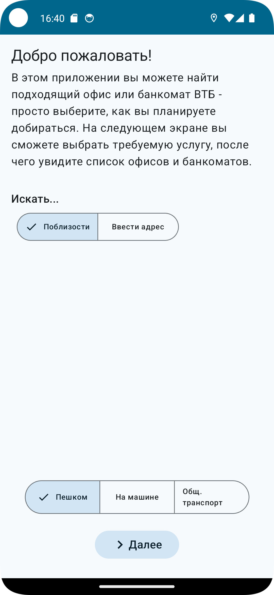
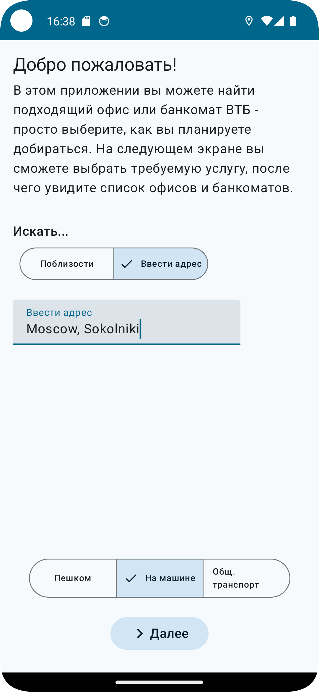
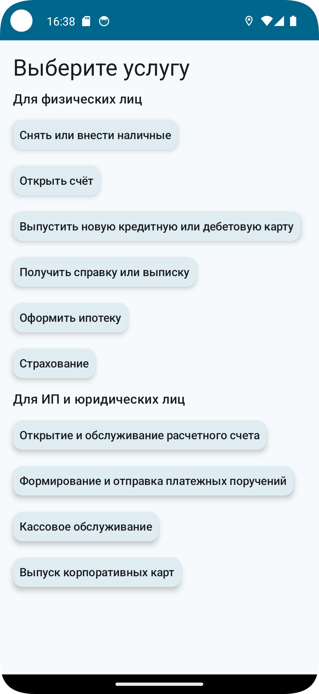
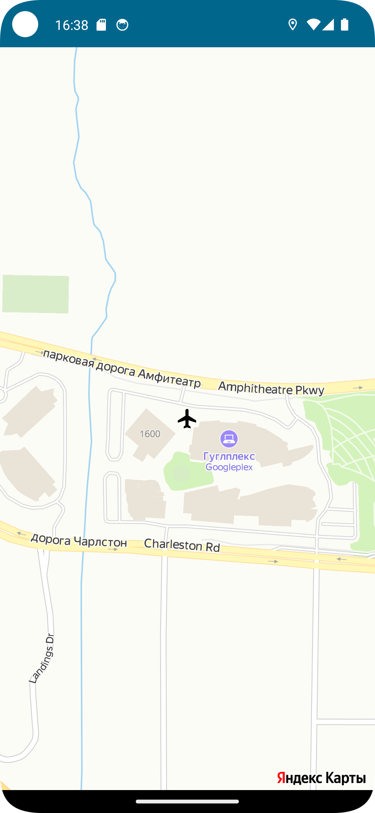

# MoreTech2023
MoreTech 5.0 2023 Hackaton VTB Android app
# Задача не выполнена.
# Роли
1. Сергей - UI
2. Никита - Yandex Maps
3. Максим - парсинг данных
# Что использовали
Для UI: Jetpack Compose, Navigation, Glide
Для карт: Yandex Maps SDK и API.
# Что было сделано
4 экрана:
1. Стартовый экран - возможность искать отделения по адресу или по локации, а также выбрать вид транспорта
2. Экран выбора нужного сервиса - для физ. лиц и для бизнеса
3. Экран карты - показывает нужное расположение (не закончен)
4. Экран информации об отделении - показывает все данные о выбранном отделении (не закончен)

Демонстрация и скриншоты:

